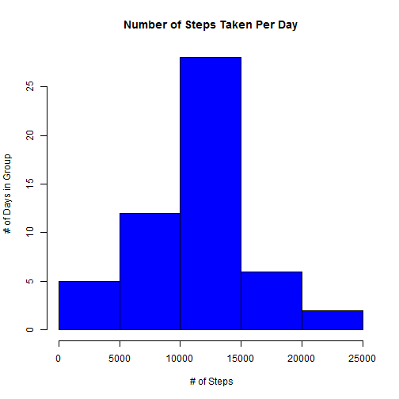
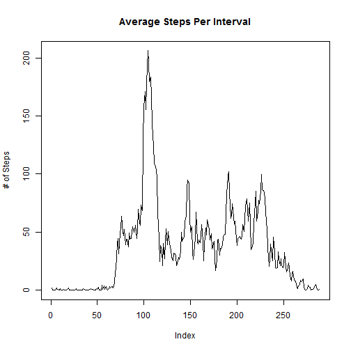
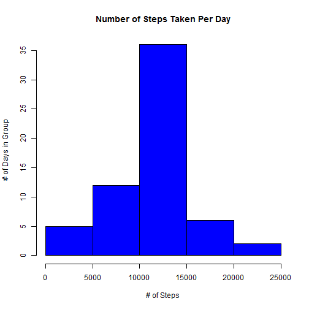
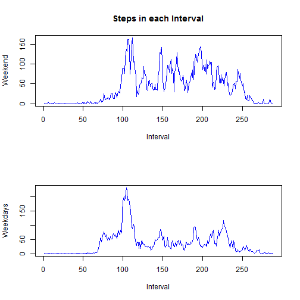

## Loading and preprocessing the data

```r
## Set working directory

setwd("c:/coursera/")

## Read Source Data

actdata <- read.csv('activity.csv')
```


## What is mean total number of steps taken per day?

```r
## Calculate total steps per day without 
## regard to rows with NA

totalstepsperday <- tapply(actdata$steps, actdata$date, sum)
```

```r
## Histogram of total steps taken each day

hist(totalstepsperday, breaks = 5, main = "Number of Steps Taken Per Day", 
     xlab = " # of Steps", ylab = "# of Days in Group", col = "Blue")
```

 

```r
## Calculate Mean Steps per Day

meanstepsperday <- mean(totalstepsperday, na.rm = T)
meanstepsperday
```

```
## [1] 10766.19
```

```r
## Calculate Median Steps per day

medianstepsperday <- median(totalstepsperday, na.rm = T)
medianstepsperday
```

```
## [1] 10765
```


## What is the average daily activity pattern?


```r
## Time series plot (type = "l") of the 5-minute interval (x-axis) 
## and the average number of steps taken, averaged across all days (y-axis)

meanstepperint <- tapply(actdata$steps, actdata$interval, mean, na.rm = T)
plot(meanstepperint, type="l", main =  "Average Steps Per Interval", ylab = "# of Steps")
```

 


```r
## Find interval with maximum number of steps

seq(along = meanstepperint)[meanstepperint == max(meanstepperint)]
```

```
## [1] 104
```

## Imputing missing values

```r
## Calculate number of missing values

sum(as.numeric(is.na(actdata$steps)))
```

```
## [1] 2304
```

```r
## fill in missing data

##Set mean steps interval data as a vector and repeat it for the 61 days
fillmeanstepint <- as.vector(meanstepperint)
fillmeanstepint <- rep(fillmeanstepint, 61)
## set value to 1 where it is not NA
fillmeanstepint [!is.na(actdata$steps)] = 1

## steps data as a vector and set to where data is missing
fillstepdata <- as.vector(actdata$steps)
fillstepdata [is.na(fillstepdata)] = 1

newdata <- actdata
newdata$steps <- fillmeanstepint * fillstepdata
totstepdaynomiss <- tapply(newdata$steps, newdata$date, sum)
```

```r
## Create histogram
hist(totstepdaynomiss, breaks = 5, main = "Number of Steps Taken Per Day",
     xlab = "# of Steps", ylab = "# of Days in Group", col = "Blue" )
```

 

Imputing the values for missing data increases the average number of steps taken per day as can be seen by comparing the middle bar of the histograms for Number of Steps taken per day in this chart to the histogram 2 charts above.

## Are there differences in activity patterns between weekdays and weekends?

```r
## set up weekdays and weekends

days1 <- as.POSIXlt(newdata$date, format = "%Y-%m-%d")
days2 <- days1$wday
days2[days2 == 0] = 0
days2[days2 == 6] = 0
days2[days2 != 0] = 1
days3 <- factor(days2, levels = c(0,1))
newdata$WD <- days3

weekdaymeansteps <- tapply(newdata$steps, list(newdata$interval, newdata$WD), mean, na.rm = T)
```

```r
par(mfrow = c(2,1))

with(newdata, {

  plot(weekdaymeansteps[,1],type = "l", col = "Blue", main = ("Steps in each Interval"),
       xlab = "Interval", ylab = "Weekend")
  title = ("# of Steps per Interval")

  plot(weekdaymeansteps[, 2], type = "l", col = "Blue", 
       xlab="Interval", ylab = "Weekdays")
})
```

 

